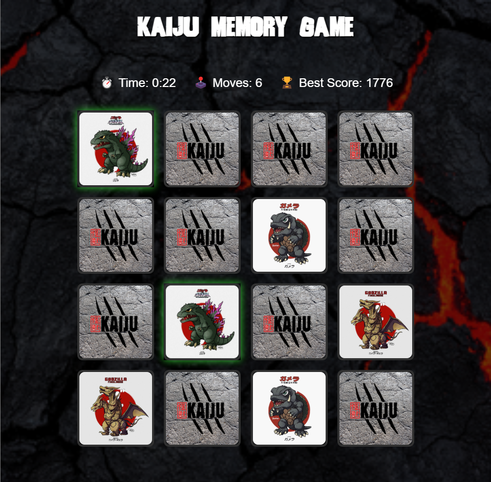

# Lab 6 React: Juego de Memoria

**Universidad del Valle de Guatemala**  
**Facultad de Ingeniería**  
**Departamento de Ciencias de la Computación**  
**Curso: Sistemas y Tecnologías Web**  

## Autor
- **Diego Leiva** – 21752

## Descripción
Este proyecto consiste en un juego de memoria implementado en **React** usando **un solo archivo HTML**. El objetivo es encontrar todas las parejas de cartas de Kaijus en el menor tiempo y número de movimientos posible.

El juego cuenta con:
- Animaciones de flip para las cartas.
- Posiciones aleatorias en cada nueva partida.
- Contador de movimientos y temporizador en tiempo real.
- Sistema de puntaje basado en eficiencia (tiempo + movimientos).
- Sistema de estrellas según el desempeño del jugador.
- Almacenamiento del mejor puntaje usando **LocalStorage**.
- Estilo responsivo adaptable a distintos tamaños de pantalla.
- Estética inspirada en temática de Kaijus.

## Tecnologías
- HTML5
- CSS3 (puro, sin frameworks)
- JavaScript (ES6+)
- React 18 (usando CDN)
- Babel (para JSX en navegador)

## Preview
